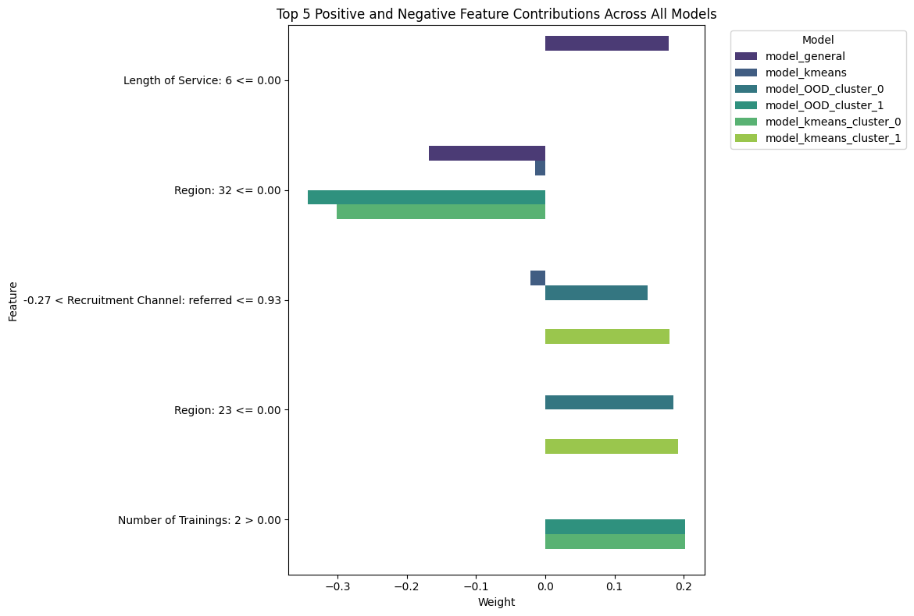

# Fairness in AI-Powered Employee Promotion Systems
## Problem Statement
* AI is increasingly used to assist promotion decisions.
* These systems often learn from biased historical data.
* This often leads to bias, especially taking sensitive attributes (like gender) into account, causing bias situations like gender bias — promoting men more often than women.
* We're studying whether AI models treat employees across all subgroups fairly in promotion outcomes.
## Research Questions
1. Should we automate decisions that shape people’s futures — and if so, how can we do it fairly?
2. How can we ensure those automated systems make decisions that are trustable enough?
## Models in Use
### The Baseline Model - MLP Classifier

### The K-Means Method

### An Ordinary Model handling Out-Of-Distribution (OOD) Scenarios

### A Cluster-based Model handling OOD Scenarios

## Explainability
* We use LIME as the explainer. 

Here's a comparison of the top 5 positively and negatively contributed features across all models:

